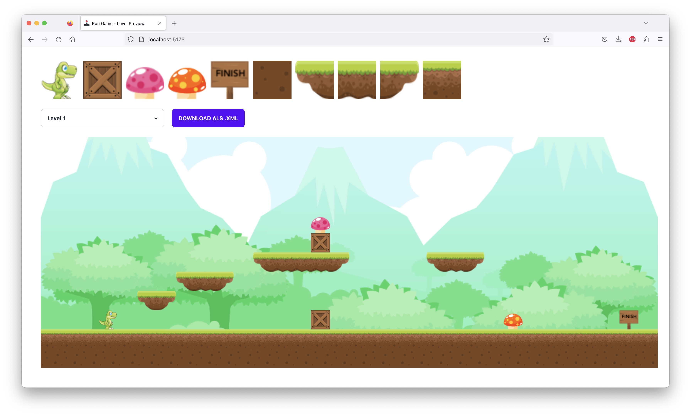

# Visual Computing Level Preview

Visual Computing Level Preview, ein Projekt von Robert Ackermann. Made with ♥ and ☕ in Erfurt.

## Allgemein

Dieses Tool wurde erstellt, um eine einfache Möglichkeit zu haben, Maps für das Spiel "Run Game" für das Modul Visual Computing, erstellen und anzeigen zu können.
Voraussetzung um das Programm starten zu können ist eine installierte und lauffähige Version von Node.js.

### Quelle der Assets
Die Assets stammen von der Plattform [GAME ART 2D](https://www.gameart2d.com/). 

### Installation

```
git clone https://github.com/batzlov/visual-computing-level-preview.git

cd visual-computing-level-preview

npm install
```

### Starten der Anwendung

```
npm run dev
```

## Anwendung
### Erstellen einer Map

Eine Map kann durch ein JSON-Objekt inklsuive einer Matrix definiert werden. Per Klick auf den Download-Button kann die Map dann ganz einfach im .xml Format heruntergeladen werden. Die Matrix besteht aus Zahlen, die jeweils eine Textur repräsentieren. Die Zahlen sind wie folgt definiert:

| Zahl | Textur |
| ---- | ---- |
| 1 | Erde mit Gras |
| 2 | Erde |
| 3 | Plattform Start |
| 4 | Plattform Mitte |
| 5 | Plattform Ende |
| 6 | Spieler |
| 7 | Ziel |
| 8 | Kiste |
| 9 | Magischer Pilz |
| 10 | Giftiger Pilz |

#### Beispiel

```js
export const level1 = {
    id: 1,
    name: "Level 1",
    matrix: [
        [ 0,  0,  0,  0,  0,  0,  0,  0,  0,  0,  0,  0,  0,  0,  0,  0,  0,  0,  0,  0,  0,  0,  0,  0,  0,  0,  0,  0,  0,  0,  0,  0, ], // top
        [ 0,  0,  0,  0,  0,  0,  0,  0,  0,  0,  0,  0,  0,  0,  0,  0,  0,  0,  0,  0,  0,  0,  0,  0,  0,  0,  0,  0,  0,  0,  0,  0, ], 
        [ 0,  0,  0,  0,  0,  0,  0,  0,  0,  0,  0,  0,  0,  0,  0,  0,  0,  0,  0,  0,  0,  0,  0,  0,  0,  0,  0,  0,  0,  0,  0,  0, ], 
        [ 0,  0,  0,  0,  0,  0,  0,  0,  0,  0,  0,  0,  0,  0,  0,  0,  0,  0,  0,  0,  0,  0,  0,  0,  0,  0,  0,  0,  0,  0,  0,  0, ], 
        [ 0,  0,  0,  0,  0,  0,  0,  0,  0,  0,  0,  0,  0,  0,  9,  0,  0,  0,  0,  0,  0,  0,  0,  0,  0,  0,  0,  0,  0,  0,  0,  0, ], 
        [ 0,  0,  0,  0,  0,  0,  0,  0,  0,  0,  0,  0,  0,  0,  8,  0,  0,  0,  0,  0,  0,  0,  0,  0,  0,  0,  0,  0,  0,  0,  0,  0, ], 
        [ 0,  0,  0,  0,  0,  0,  0,  0,  0,  0,  0,  3,  4,  4,  4,  5,  0,  0,  0,  0,  3,  4,  5,  0,  0,  0,  0,  0,  0,  0,  0,  0, ], 
        [ 0,  0,  0,  0,  0,  0,  0,  3,  4,  5,  0,  0,  0,  0,  0,  0,  0,  0,  0,  0,  0,  0,  0,  0,  0,  0,  0,  0,  0,  0,  0,  0, ], 
        [ 0,  0,  0,  0,  0,  3,  5,  0,  0,  0,  0,  0,  0,  0,  0,  0,  0,  0,  0,  0,  0,  0,  0,  0,  0,  0,  0,  0,  0,  0,  0,  0, ], 
        [ 0,  0,  0,  6,  0,  0,  0,  0,  0,  0,  0,  0,  0,  0,  8,  0,  0,  0,  0,  0,  0,  0,  0, 10,  0,  0,  0,  0,  0,  0,  7,  0, ], 
        [ 2,  2,  2,  2,  2,  2,  2,  2,  2,  2,  2,  2,  2,  2,  2,  2,  2,  2,  2,  2,  2,  2,  2,  2,  2,  2,  2,  2,  2,  2,  2,  2, ], 
        [ 1,  1,  1,  1,  1,  1,  1,  1,  1,  1,  1,  1,  1,  1,  1,  1,  1,  1,  1,  1,  1,  1,  1,  1,  1,  1,  1,  1,  1,  1,  1,  1, ], // bottom
    ]
}
```

### Screenshots



